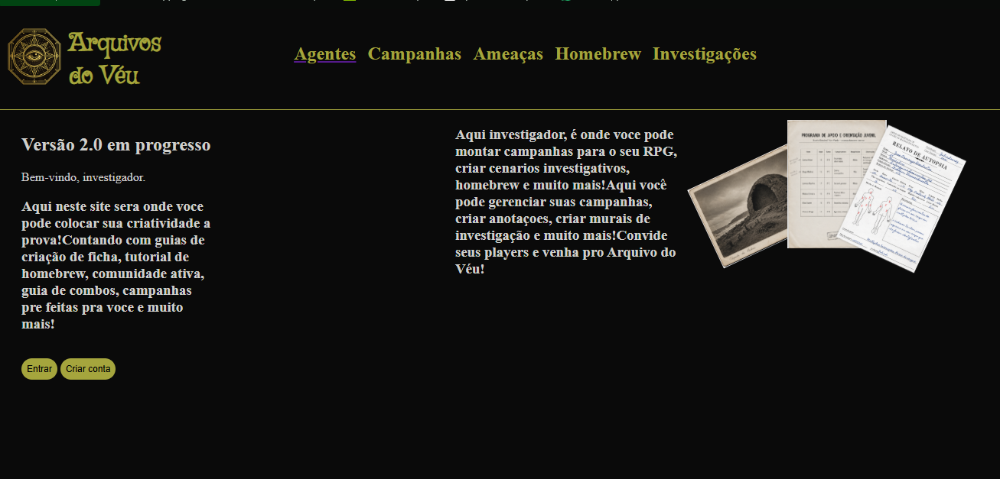
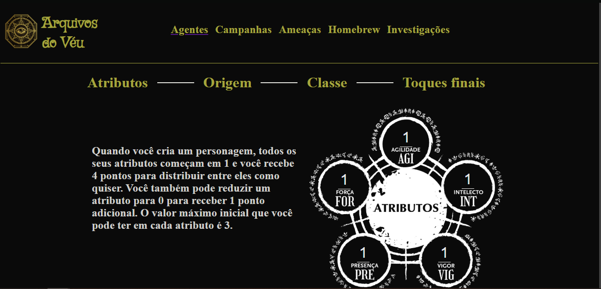

# Arquivos do Véu

Sistema web inspirado em Ordem Paranormal RPG, desenvolvido para auxiliar mestres e jogadores na criação e gerenciamento de personagens, campanhas e investigações.

 ## Funcionalidades
 Criação de personagens
 Sistema de atributos
 Escolha de origem
 Sistema de classes (em desenvolvimento)
 Campanhas (futuramente será adicionada)
 Homebrew (futuramente será adicionada)
 Investigações (futuramente será adicionada)
 Tecnologias (futuramente será adicionada)

HTML5
CSS3
JavaScript

 Objetivos do projeto
O Arquivo do Véu foi criado como um projeto de estudo para desenvolver habilidades em desenvolvimento web enquanto cria uma ferramenta inspirada no universo de Ordem Paranormal.

 Próximas funcionalidades
Sistema completo de classes
Banco de dados
Login
Perfis
Campanhas online
Sistema de investigação
Inventário

Autor

Arthur Gonçalves

Em desenvolvimento 

# PREVIEW

